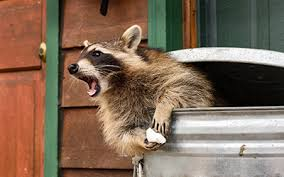
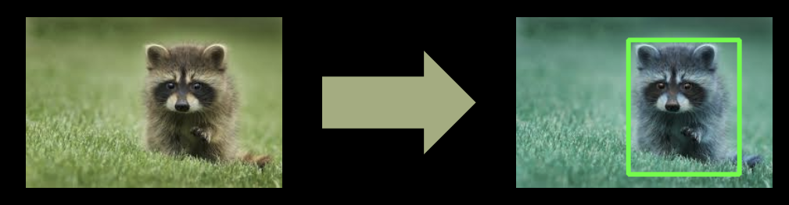

# Raccoon Object Detection

## Description

Raccoon Object Detection is a machine learning project designed to accurately detect raccoons in images. Utilizing the EfficientNetB3 model, this project processes images to identify and localize raccoons, demonstrating the application of deep learning techniques in object detection.

## Motivation

The motivation behind developing this project was to explore and implement advanced object detection techniques, focusing on raccoons as the subject. This project showcases the practical application of machine learning and computer vision in identifying specific objects within images, enhancing skills in image processing, model training, and evaluation.

## Problem Statement

The primary problem this project addresses is the detection and localization of raccoons in various images. By building a robust model, this project aims to provide accurate predictions and visualize the results, demonstrating the effectiveness of deep learning in object detection tasks.

## What I've Learned

- Implementation of deep learning models for object detection.
- Preprocessing images and annotations for model training.
- Utilizing Selective Search for region proposals.
- Utilizing NMS for creating ground-truth boxes.
- Training and evaluating RCNN model.
- Visualizing detection results.

## Project Highlights

- **EfficientNetB3 Model**: Utilizes a state-of-the-art deep learning model for accurate object detection.
- **Selective Search Algorithm**: Generates region proposals to improve detection efficiency.
- **Comprehensive Pipeline**: Includes data loading, preprocessing, model training, and evaluation.
- **Visualization**: Provides clear visualizations of detection results, enhancing interpretability.

## Tech Stack

- **Programming Languages**: Python
- **Libraries**: OpenCV, TensorFlow, Keras, NumPy, Pandas, BeautifulSoup

## Design

### User Interface

The project includes visualization of detection results. Here is an example of the interface showing detected raccoons:

## Features

- Load and preprocess images and annotations.
- Generate region proposals using Selective Search.
- Train RCNN model for raccoon detection.
- Evaluate and visualize model performance.
- Predict raccoons in new images and visualize results.

## How to Run the Project

### Prerequisites

Ensure you have the following libraries installed:
- Python 3.x
- OpenCV
- TensorFlow
- Keras
- NumPy
- Pandas
- BeautifulSoup
- Google Colab specific libraries
